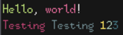

# bited-utils

[](https://pkg.go.dev/github.com/molarmanful/bited-utils)
[](https://flakehub.com/flake/molarmanful/bited-utils)

Pipeline helpers and utilities for building fonts from bited BDFs. Built with Go
and Nix flakes.

- [**bited-build**](https://pkg.go.dev/github.com/molarmanful/bited-utils/bited-build):
  A command that generates vector (TTF, WOFF2) and bitmap (BDF, PCF, OTB, DFONT)
  fonts from bited BDFs. Supports integer scaling and Nerd Font patching.
- [**bited-img**](https://pkg.go.dev/github.com/molarmanful/bited-utils/bited-img):
  A command that generates image specimens for bited BDFs. Features Base16 color
  support.
- [**bited-clr**](https://pkg.go.dev/github.com/molarmanful/bited-utils/bited-clr):
  A TUI tool for fine-tuned coloring of TXT/CLR pairs.
- [**bited-scale**](https://pkg.go.dev/github.com/molarmanful/bited-utils/bited-scale):
  A command for scaling bited BDFs.
- [**bited-bbl**](https://pkg.go.dev/github.com/molarmanful/bited-utils/bited-bbl):
  A command for proportionalizing bited BDFs.

## Built with bited-utils

### [kirsch](https://github.com/molarmanful/kirsch)


### [ANAKRON](https://github.com/molarmanful/ANAKRON)


## Nix flake template

In a blank directory where you want your font project to reside, run:

```bash
nix flake init --template github:molarmanful/bited-utils
```

This will create an annotated [template project](template) with Nix scaffolding
around bited-utils to help get your font project up and running.

## TXT/CLR files

To generate colorful images, bited-img accepts pairs of `.txt` and `.clr` files.
For example, if you have a file `test.txt` that you wish to color, you would
include `test.clr` containing your desired color codes in the same directory.

A `.clr` file is really just lines of spaces and color codes. The color codes
are as follows:

| Code         | Definition                  |
| ------------ | --------------------------- |
| `0-9`, `A-F` | Set color to a Base16 color |
| `.`          | Reset to foreground color   |

All other characters are treated as no-ops and simply pass on the current color.

Codes are interpreted left-to-right, top-to-bottom. The position of a code
matches a position in the TXT file where you wish to color. Say you have the
following TXT:

```
Hello, world!
Testing Testing 123
```

And the following CLR:

```
A    . D    .
5       6       BCE
```

Would produce:



### Why TXT/CLR?

When designing the pipeline for creating color specimens for my fonts (what
would eventually become bited-img), I initially considered several existing
approaches to creating the specimen sources:

- Writing Pango markup directly, which would make passing them to ImageMagick
  super easy.
- Creating ANSI via an editor and then generating the Pango markup.

Both of these approaches suffer from a rather important flaw, however: because
they embed color data alongside content in the same file, their source files are
difficult to read and/or write in a text editor. So my caveman solution was to
just separate the color data into its own file, which preserves a readable TXT
source.

My workflow for creating these TXT/CLR files goes something like:

1. Create the TXT file with uncolored contents.
1. Copy the TXT file to CLR.
1. Block out the CLR file with color codes. Neovim's visual block mode is
   especially well-suited for this.
1. Remove extraneous text and use bited-clr for finer adjustments if necessary.
