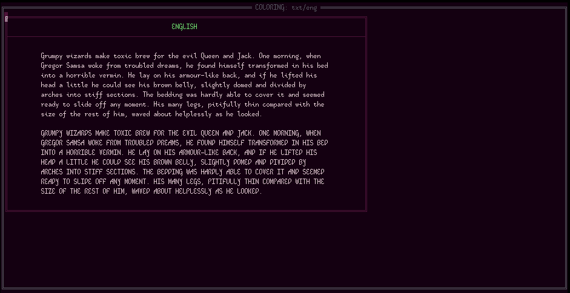

# bited-clr

A TUI tool for fine-tuned coloring of TXT/CLR pairs.

### Keybindings

| Keys               | Action           |
| ------------------ | ---------------- |
| `hjkl`, arrow keys | move cursor      |
| `.`                | foreground color |
| `0-9`, `a-f`       | Base16 colors    |
